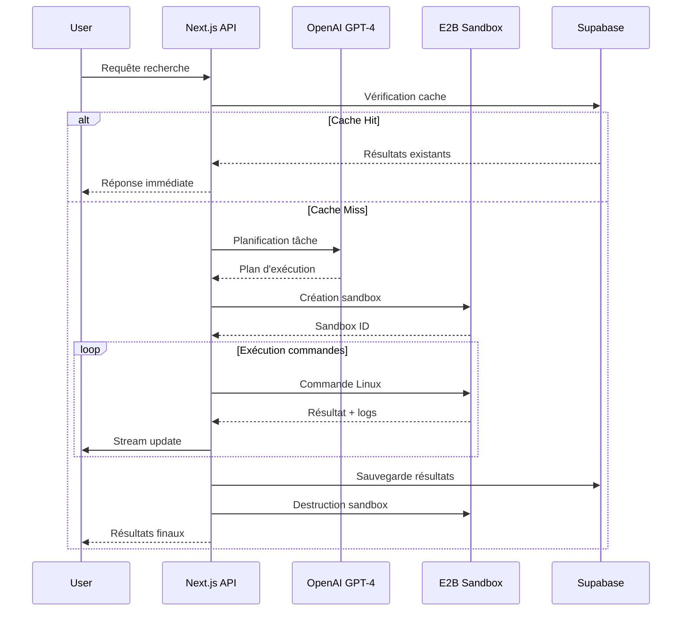

# Guide d'Optimisation E2B - Stratégies de Coûts et Performance

## 1. Architecture Éphémère Optimisée

### 1.1 Principe de Base

**Stratégie "Create-Execute-Destroy"** :

* Création sandbox à la demande (< 2 secondes)

* Exécution ciblée avec timeout intelligent

* Destruction immédiate post-traitement

* Zéro coût d'inactivité

### 1.2 Cycle de Vie Optimisé



## 2. Configuration E2B Optimale

### 2.1 Spécifications Recommandées

```typescript
// Configuration sandbox optimisée coûts
const sandboxConfig = {
  // Ressources minimales pour la plupart des tâches
  template: 'base', // Ubuntu 22.04 LTS
  
  // Timeout intelligent basé sur le type de tâche
  timeoutMs: calculateTimeout(taskType), // 30s-300s
  
  // Outils pré-installés essentiels
  metadata: {
    tools: [
      'curl', 'wget', 'jq', 'python3', 'node',
      'git', 'docker', 'sqlite3', 'postgresql-client'
    ]
  }
}

// Fonction de calcul timeout dynamique
function calculateTimeout(taskType: string): number {
  const timeouts = {
    'web-scraping': 60000,      // 1 minute
    'data-analysis': 180000,    // 3 minutes
    'api-research': 30000,      // 30 secondes
    'file-processing': 120000,  // 2 minutes
    'complex-analysis': 300000  // 5 minutes max
  }
  return timeouts[taskType] || 60000
}
```

### 2.2 Gestion des Ressources

```typescript
// Service E2B avec optimisations
class OptimizedE2BService {
  private activeSandboxes = new Map<string, SandboxInfo>()
  private costTracker = new CostTracker()
  
  async createSandbox(taskId: string, config: SandboxConfig) {
    const startTime = Date.now()
    
    try {
      // Création avec monitoring coût
      const sandbox = await E2B.create(config)
      
      // Enregistrement pour tracking
      this.activeSandboxes.set(taskId, {
        sandboxId: sandbox.id,
        startTime,
        estimatedCost: 0,
        commands: []
      })
      
      // Timeout de sécurité
      setTimeout(() => {
        this.forcedDestroy(taskId, 'timeout')
      }, config.timeoutMs)
      
      return sandbox
    } catch (error) {
      this.costTracker.recordFailure(taskId, Date.now() - startTime)
      throw error
    }
  }
  
  async executeCommand(taskId: string, command: string) {
    const sandboxInfo = this.activeSandboxes.get(taskId)
    if (!sandboxInfo) throw new Error('Sandbox not found')
    
    const startTime = Date.now()
    
    try {
      const result = await sandbox.terminal.exec(command)
      const duration = Date.now() - startTime
      
      // Mise à jour coût estimé
      sandboxInfo.estimatedCost += this.calculateCommandCost(duration)
      sandboxInfo.commands.push({ command, duration, result })
      
      return result
    } catch (error) {
      // Log erreur mais continue
      console.error(`Command failed: ${command}`, error)
      throw error
    }
  }
  
  async destroySandbox(taskId: string, reason = 'completed') {
    const sandboxInfo = this.activeSandboxes.get(taskId)
    if (!sandboxInfo) return
    
    try {
      // Destruction immédiate
      await E2B.destroy(sandboxInfo.sandboxId)
      
      // Calcul coût final
      const totalDuration = Date.now() - sandboxInfo.startTime
      const finalCost = this.calculateFinalCost(totalDuration)
      
      // Enregistrement en base
      await this.saveSandboxExecution(taskId, sandboxInfo, finalCost)
      
      // Nettoyage mémoire
      this.activeSandboxes.delete(taskId)
      
      return { cost: finalCost, duration: totalDuration }
    } catch (error) {
      console.error('Sandbox destruction failed:', error)
      // Force cleanup même en cas d'erreur
      this.activeSandboxes.delete(taskId)
    }
  }
  
  private calculateCommandCost(durationMs: number): number {
    // E2B: ~$0.000028 par seconde pour config standard
    const secondsUsed = durationMs / 1000
    return secondsUsed * 0.000028
  }
}
```

## 3. Stratégies d'Optimisation Avancées

### 3.1 Cache Intelligent

```typescript
// Système de cache sémantique
class SemanticCache {
  async checkCache(query: string, userId: string): Promise<CacheResult | null> {
    // Génération embedding de la requête
    const queryEmbedding = await this.generateEmbedding(query)
    
    // Recherche similarité dans Supabase
    const { data } = await supabase.rpc('search_similar_tasks', {
      query_embedding: queryEmbedding,
      user_id_param: userId,
      similarity_threshold: 0.85, // 85% de similarité
      max_results: 3
    })
    
    if (data && data.length > 0) {
      const bestMatch = data[0]
      
      // Vérification fraîcheur (< 24h pour données dynamiques)
      const isRecent = this.isResultRecent(bestMatch.created_at, query)
      
      if (isRecent && bestMatch.similarity > 0.9) {
        return {
          cached: true,
          results: await this.getTaskResults(bestMatch.task_id),
          similarity: bestMatch.similarity,
          savedCost: 0.01 // Coût évité
        }
      }
    }
    
    return null
  }
  
  private isResultRecent(createdAt: string, query: string): boolean {
    const age = Date.now() - new Date(createdAt).getTime()
    const maxAge = this.getMaxCacheAge(query)
    return age < maxAge
  }
  
  private getMaxCacheAge(query: string): number {
    // Durée cache basée sur type de requête
    if (query.includes('temps réel') || query.includes('actualité')) {
      return 1000 * 60 * 30 // 30 minutes
    }
    if (query.includes('prix') || query.includes('cours')) {
      return 1000 * 60 * 60 * 2 // 2 heures
    }
    return 1000 * 60 * 60 * 24 // 24 heures par défaut
  }
}
```

### 3.2 Planification Intelligente

```typescript
// Optimiseur de plan d'exécution
class ExecutionPlanner {
  async optimizePlan(query: string, context: string[]): Promise<ExecutionPlan> {
    const prompt = `
Analyse cette requête et génère un plan d'exécution Linux optimisé :

Requête: ${query}
Contexte: ${context.join(', ')}

Critères d'optimisation :
1. Minimiser le temps d'exécution (< 2 minutes idéalement)
2. Utiliser des commandes efficaces (curl, jq, python one-liners)
3. Éviter les installations lourdes
4. Paralléliser quand possible
5. Gérer les erreurs gracieusement

Format de réponse JSON :
{
  "estimatedDuration": 60,
  "estimatedCost": 0.002,
  "commands": [
    {
      "step": 1,
      "command": "curl -s 'https://api.example.com/data' | jq '.results'",
      "description": "Récupération données API",
      "timeout": 30,
      "retryable": true
    }
  ],
  "fallbackStrategy": "Si échec API, utiliser scraping web"
}
`
    
    const response = await openai.chat.completions.create({
      model: 'gpt-4-turbo-preview',
      messages: [{ role: 'user', content: prompt }],
      temperature: 0.1 // Réponses déterministes
    })
    
    return JSON.parse(response.choices[0].message.content)
  }
  
  validatePlan(plan: ExecutionPlan): ValidationResult {
    const issues = []
    
    // Vérification durée
    if (plan.estimatedDuration > 300) {
      issues.push('Durée trop longue, risque de timeout')
    }
    
    // Vérification coût
    if (plan.estimatedCost > 0.05) {
      issues.push('Coût estimé élevé, optimisation recommandée')
    }
    
    // Vérification commandes dangereuses
    const dangerousCommands = ['rm -rf', 'sudo', 'chmod 777']
    plan.commands.forEach(cmd => {
      if (dangerousCommands.some(danger => cmd.command.includes(danger))) {
        issues.push(`Commande potentiellement dangereuse: ${cmd.command}`)
      }
    })
    
    return {
      valid: issues.length === 0,
      issues,
      optimizedPlan: this.optimizeIfNeeded(plan, issues)
    }
  }
}
```

## 4. Monitoring et Alertes

### 4.1 Tracking des Coûts

```typescript
// Système de monitoring coûts
class CostMonitor {
  private readonly COST_THRESHOLDS = {
    user: 0.10,    // $0.10 par requête utilisateur
    daily: 5.00,   // $5.00 par jour par utilisateur
    monthly: 50.00 // $50.00 par mois par utilisateur
  }
  
  async checkBudget(userId: string, estimatedCost: number): Promise<BudgetCheck> {
    const usage = await this.getUserUsage(userId)
    
    return {
      allowed: usage.monthly + estimatedCost <= this.COST_THRESHOLDS.monthly,
      currentUsage: usage,
      estimatedCost,
      remainingBudget: this.COST_THRESHOLDS.monthly - usage.monthly,
      warnings: this.generateWarnings(usage, estimatedCost)
    }
  }
  
  async recordCost(userId: string, taskId: string, actualCost: number) {
    // Enregistrement en base
    await supabase.from('cost_tracking').insert({
      user_id: userId,
      task_id: taskId,
      cost: actualCost,
      timestamp: new Date().toISOString()
    })
    
    // Vérification seuils
    const dailyUsage = await this.getDailyUsage(userId)
    if (dailyUsage > this.COST_THRESHOLDS.daily * 0.8) {
      await this.sendCostAlert(userId, 'daily_threshold_warning')
    }
  }
  
  private generateWarnings(usage: Usage, estimatedCost: number): string[] {
    const warnings = []
    
    if (usage.monthly > this.COST_THRESHOLDS.monthly * 0.8) {
      warnings.push('Approche de la limite mensuelle')
    }
    
    if (estimatedCost > this.COST_THRESHOLDS.user) {
      warnings.push('Coût de requête élevé')
    }
    
    return warnings
  }
}
```

### 4.2 Métriques de Performance

```typescript
// Dashboard métriques temps réel
interface PerformanceMetrics {
  // Métriques E2B
  avgSandboxCreationTime: number
  avgExecutionTime: number
  avgDestructionTime: number
  
  // Métriques coûts
  avgCostPerTask: number
  totalDailyCost: number
  costEfficiencyRatio: number
  
  // Métriques qualité
  successRate: number
  cacheHitRate: number
  userSatisfactionScore: number
}

class MetricsCollector {
  async collectMetrics(timeframe: '1h' | '24h' | '7d'): Promise<PerformanceMetrics> {
    const { data } = await supabase.rpc('get_performance_metrics', {
      timeframe
    })
    
    return {
      avgSandboxCreationTime: data.avg_creation_time,
      avgExecutionTime: data.avg_execution_time,
      avgDestructionTime: data.avg_destruction_time,
      avgCostPerTask: data.avg_cost_per_task,
      totalDailyCost: data.total_daily_cost,
      costEfficiencyRatio: data.cache_savings / data.total_cost,
      successRate: data.successful_tasks / data.total_tasks,
      cacheHitRate: data.cache_hits / data.total_requests,
      userSatisfactionScore: data.avg_user_rating
    }
  }
}
```

## 5. Stratégies de Fallback

### 5.1 Gestion des Échecs

```typescript
// Système de fallback intelligent
class FallbackManager {
  async handleSandboxFailure(taskId: string, error: E2BError): Promise<FallbackResult> {
    const fallbackStrategies = [
      this.tryAlternativeRegion,
      this.useLocalExecution,
      this.useCachedSimilarResult,
      this.simplifyTask
    ]
    
    for (const strategy of fallbackStrategies) {
      try {
        const result = await strategy(taskId, error)
        if (result.success) {
          await this.logFallbackSuccess(taskId, strategy.name)
          return result
        }
      } catch (fallbackError) {
        console.warn(`Fallback ${strategy.name} failed:`, fallbackError)
      }
    }
    
    // Dernier recours : réponse LLM sans exécution
    return this.generateLLMOnlyResponse(taskId)
  }
  
  private async tryAlternativeRegion(taskId: string): Promise<FallbackResult> {
    // Tentative création sandbox dans région différente
    const alternativeConfig = {
      ...defaultConfig,
      region: 'eu-west-1' // Si us-east-1 échoue
    }
    
    return this.createAndExecute(taskId, alternativeConfig)
  }
  
  private async useLocalExecution(taskId: string): Promise<FallbackResult> {
    // Exécution de commandes "safe" côté serveur
    const safeCommands = ['curl', 'wget', 'node -e', 'python3 -c']
    // Implémentation sécurisée...
  }
}
```

## 6. Optimisations Futures

### 6.1 Prédiction de Coûts

```typescript
// ML pour prédiction coûts
class CostPredictor {
  async predictCost(query: string, userHistory: TaskHistory[]): Promise<CostPrediction> {
    // Analyse patterns utilisateur
    const features = this.extractFeatures(query, userHistory)
    
    // Modèle simple basé sur historique
    const similarTasks = userHistory.filter(task => 
      this.calculateSimilarity(task.query, query) > 0.7
    )
    
    if (similarTasks.length > 0) {
      const avgCost = similarTasks.reduce((sum, task) => sum + task.cost, 0) / similarTasks.length
      const confidence = Math.min(similarTasks.length / 5, 1) // Max confidence avec 5+ exemples
      
      return {
        estimatedCost: avgCost,
        confidence,
        basedOn: `${similarTasks.length} tâches similaires`,
        range: [avgCost * 0.7, avgCost * 1.3]
      }
    }
    
    // Fallback sur moyennes globales
    return this.getGlobalAverages(query)
  }
}
```

### 6.2 Auto-scaling Intelligent

```typescript
// Gestion charge adaptative
class LoadBalancer {
  private readonly MAX_CONCURRENT_SANDBOXES = 10
  private activeTasks = new Set<string>()
  private taskQueue: QueuedTask[] = []
  
  async queueTask(task: ResearchTask): Promise<QueueResult> {
    if (this.activeTasks.size < this.MAX_CONCURRENT_SANDBOXES) {
      // Exécution immédiate
      this.activeTasks.add(task.id)
      return { queued: false, estimatedWait: 0 }
    }
    
    // Mise en queue avec priorité
    const priority = this.calculatePriority(task)
    this.taskQueue.push({ ...task, priority })
    this.taskQueue.sort((a, b) => b.priority - a.priority)
    
    return {
      queued: true,
      position: this.taskQueue.findIndex(t => t.id === task.id) + 1,
      estimatedWait: this.estimateWaitTime()
    }
  }
  
  private calculatePriority(task: ResearchTask): number {
    let priority = 0
    
    // Utilisateurs premium = priorité haute
    if (task.user.plan === 'premium') priority += 100
    
    // Tâches rapides = priorité haute
    if (task.estimatedDuration < 60) priority += 50
    
    // Pénalité pour tâches coûteuses
    if (task.estimatedCost > 0.02) priority -= 25
    
    return priority
  }
}
```

## 7. Checklist d'Optimisation

### ✅ Optimisations Essentielles

* [ ] **Cache sémantique** : Éviter re-exécution requêtes similaires

* [ ] **Timeouts intelligents** : Adaptation durée selon type tâche

* [ ] **Destruction immédiate** : Zéro coût d'inactivité

* [ ] **Monitoring coûts** : Alertes seuils utilisateur

* [ ] **Planification optimisée** : Commandes efficaces via LLM

* [ ] **Fallback strategies** : Gestion échecs gracieuse

* [ ] **Métriques temps réel** : Dashboard performance

* [ ] **Budget management** : Limites par utilisateur/plan

### 🎯 Objectifs de Performance

* **Coût moyen par tâche** : < $0.01

* **Temps création sandbox** : < 2 secondes

* **Taux succès** : > 95%

* **Cache hit rate** : > 30%

* **Satisfaction utilisateur** : > 4.5/5

### 📊 KPIs à Surveiller

* Coût total quotidien

* Durée moyenne d'exécution

* Taux d'échec par type de tâche

* Utilisation ressources E2B

* ROI du système de cache

