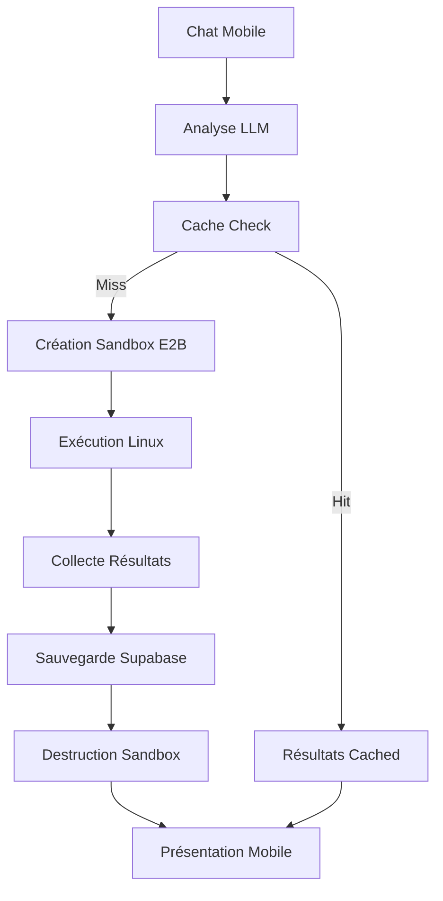

# Assistant IA Mobile avec Terminal Linux Contrôlé par LLM

## 1. Product Overview

Un assistant IA mobile permettant de contrôler un terminal Linux via des commandes en langage naturel pour effectuer des recherches internet et manipulations de données. L'application utilise des sandboxes E2B éphémères pour l'exécution sécurisée et Supabase pour la mémoire persistante avec RAG.

L'objectif est de créer un outil de recherche et d'analyse autonome accessible depuis mobile, optimisant les coûts grâce à l'architecture éphémère tout en maintenant une mémoire contextuelle intelligente.

## 2. Core Features

### 2.1 User Roles

| Role                 | Registration Method  | Core Permissions                                    |
| -------------------- | -------------------- | --------------------------------------------------- |
| Utilisateur Standard | Email + mot de passe | Accès chat, historique personnel, 100 requêtes/mois |
| Utilisateur Premium  | Upgrade payant       | Accès illimité, sessions longues, export données    |

### 2.2 Feature Module

Notre application se compose des pages principales suivantes :

1. **Page Chat Mobile** : interface conversationnelle, saisie vocale, visualisation résultats en temps réel
2. **Page Terminal Viewer** : affichage commandes Linux, logs d'exécution, monitoring ressources
3. **Page Historique** : recherche sémantique dans l'historique, favoris, export résultats
4. **Page Profil** : gestion compte, statistiques usage, paramètres optimisation

### 2.3 Page Details

| Page Name       | Module Name                 | Feature description                                                    |
| --------------- | --------------------------- | ---------------------------------------------------------------------- |
| Chat Mobile     | Interface Conversationnelle | Saisie texte/vocale, streaming réponses LLM, suggestions contextuelles |
| Chat Mobile     | Visualisation Résultats     | Affichage graphiques, tableaux, images générées, export formats        |
| Chat Mobile     | Contrôles Rapides           | Boutons actions fréquentes, templates requêtes, mode urgence           |
| Terminal Viewer | Exécution Commandes         | Affichage commandes Linux en temps réel, codes retour, durée exécution |
| Terminal Viewer | Monitoring Ressources       | CPU/RAM sandbox, coûts temps réel, alertes optimisation                |
| Terminal Viewer | Logs Système                | Historique détaillé, filtres par type, export debugging                |
| Historique      | Recherche Sémantique        | Recherche par similarité, filtres temporels, tags automatiques         |
| Historique      | Gestion Favoris             | Sauvegarde requêtes importantes, organisation dossiers, partage        |
| Historique      | Analytics Personnel         | Statistiques usage, patterns découverts, recommandations               |
| Profil          | Gestion Compte              | Authentification, abonnements, facturation, limites                    |
| Profil          | Paramètres IA               | Configuration LLM, prompts personnalisés, préférences contexte         |
| Profil          | Optimisation Coûts          | Seuils alertes, budgets mensuels, rapports consommation                |

## 3. Core Process

### Flux Utilisateur Standard

1. **Connexion** : Authentification Supabase, récupération contexte utilisateur
2. **Requête** : Saisie langage naturel via chat mobile
3. **Planification LLM** : Analyse requête, génération plan d'actions Linux
4. **Exécution Éphémère** : Création sandbox E2B, exécution commandes, collecte résultats
5. **Persistance Intelligente** : Sauvegarde résultats + embeddings dans Supabase
6. **Présentation** : Affichage résultats formatés, suggestions follow-up

### Flux Optimisation Coûts

1. **Pré-analyse** : Vérification cache Supabase pour requêtes similaires
2. **Estimation** : Calcul coût prévu, validation budget utilisateur
3. **Exécution Optimisée** : Sandbox minimal, timeout intelligent, destruction immédiate
4. **Post-traitement** : Compression données, indexation sémantique

## 4. User Interface Design

### 4.1 Design Style

* **Couleurs principales** : Noir (#000000), Blanc (#FFFFFF), Gris (#6B7280)

* **Couleurs d'accent** : Bleu électrique (#3B82F6) pour CTAs, Vert (#10B981) pour succès

* **Boutons** : Coins arrondis (rounded-2xl), ombres douces, états hover/active

* **Typographie** : Inter font, titres en text-xl/2xl, corps en text-base

* **Layout** : Grid/Flex responsive, padding généreux (p-4/p-6), espacement cohérent

* **Animations** : Framer Motion pour transitions, micro-interactions fluides

* **Icônes** : Lucide React, style minimaliste, taille cohérente

### 4.2 Page Design Overview

| Page Name       | Module Name    | UI Elements                                                            |
| --------------- | -------------- | ---------------------------------------------------------------------- |
| Chat Mobile     | Interface Chat | Messages bubbles avec gradient, input flottant, bouton vocal pulsant   |
| Chat Mobile     | Résultats      | Cards avec ombres douces, graphiques Recharts, boutons export stylisés |
| Terminal Viewer | Console        | Font monospace, couleurs terminal authentiques, scroll infini optimisé |
| Terminal Viewer | Monitoring     | Gauges circulaires animées, alertes toast, indicateurs temps réel      |
| Historique      | Liste          | Cards timeline, avatars requêtes, badges catégories, search bar sticky |
| Profil          | Dashboard      | Grille responsive, statistiques en cards, toggles settings modernes    |

### 4.3 Responsiveness

**Mobile-first** avec adaptation desktop progressive :

* **Mobile** : Navigation bottom tabs, gestures swipe, optimisation touch

* **Tablet** : Sidebar collapsible, multi-colonnes, mode landscape

* **Desktop** : Layout étendu, raccourcis clavier, fenêtres multiples

**Optimisations tactiles** :

* Zones touch 44px minimum

* Feedback haptique sur actions importantes

* Gestures naturels (pull-to-refresh, swipe-to-delete)

* Mode sombre automatique selon préférences système

