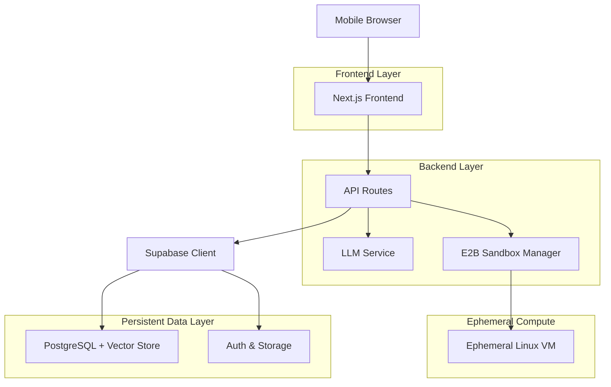
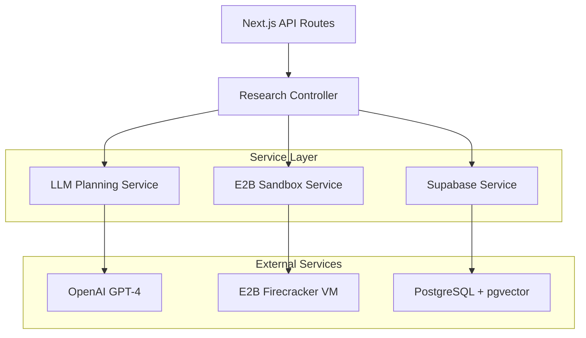
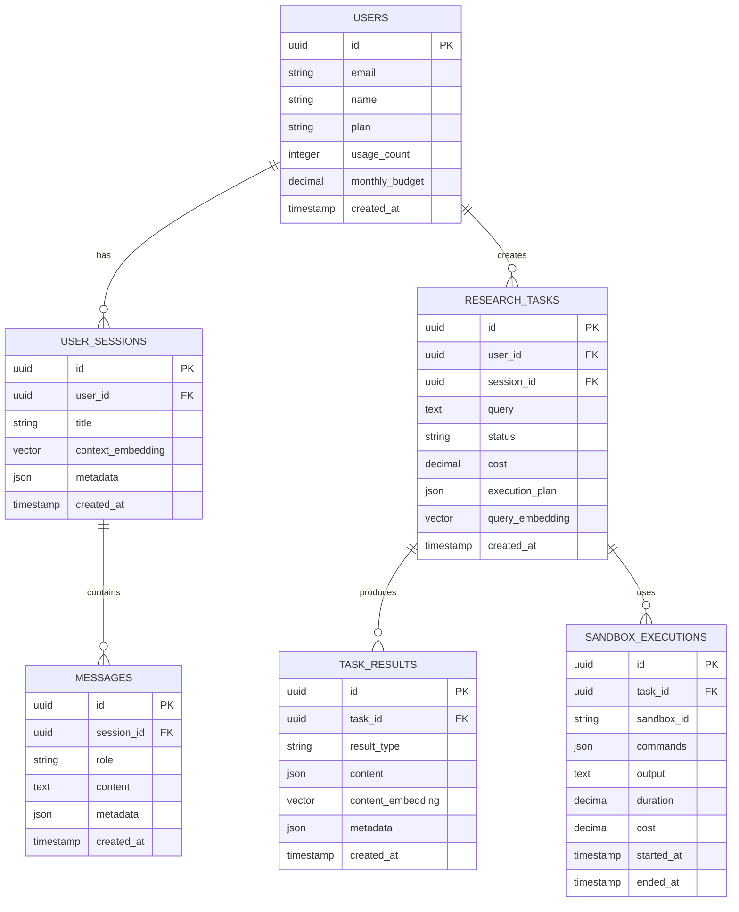

# Architecture Technique - Assistant IA Mobile avec Terminal Linux

## 1. Architecture Design



## 2. Technology Description

* **Frontend**: Next.js 14 + React 18 + TypeScript + Tailwind CSS + shadcn/ui + Framer Motion

* **Backend**: Next.js API Routes + E2B SDK + OpenAI SDK

* **Database**: Supabase (PostgreSQL + pgvector + Auth + Storage)

* **Compute**: E2B Sandboxes (Firecracker microVMs)

* **Deployment**: Vercel (Frontend + API) + Supabase Cloud

## 3. Route Definitions

| Route          | Purpose                            |
| -------------- | ---------------------------------- |
| /              | Page d'accueil avec chat principal |
| /chat          | Interface chat mobile optimisée    |
| /terminal      | Visualiseur terminal en temps réel |
| /history       | Historique des recherches avec RAG |
| /profile       | Gestion compte et paramètres       |
| /auth/login    | Authentification Supabase          |
| /auth/callback | Callback OAuth                     |

## 4. API Definitions

### 4.1 Core API

**Recherche IA avec Terminal**

```
POST /api/research
```

Request:

| Param Name | Param Type      | isRequired | Description                      |
| ---------- | --------------- | ---------- | -------------------------------- |
| query      | string          | true       | Requête en langage naturel       |
| context    | string\[]       | false      | Contexte des messages précédents |
| options    | ResearchOptions | false      | Options d'exécution              |

Response:

| Param Name | Param Type                               | Description           |
| ---------- | ---------------------------------------- | --------------------- |
| taskId     | string                                   | ID unique de la tâche |
| status     | 'planning' \| 'executing' \| 'completed' | Statut d'exécution    |
| results    | ResearchResult\[]                        | Résultats structurés  |
| cost       | number                                   | Coût en USD           |

Example:

```json
{
  "query": "Analyser les tendances crypto des 7 derniers jours",
  "context": ["conversation précédente sur Bitcoin"],
  "options": {
    "maxDuration": 300,
    "budget": 0.05
  }
}
```

**Streaming des résultats**

```
GET /api/research/[taskId]/stream
```

Server-Sent Events pour mise à jour temps réel :

```typescript
interface StreamEvent {
  type: 'command' | 'output' | 'result' | 'cost' | 'complete'
  data: any
  timestamp: string
}
```

**Gestion de l'historique**

```
GET /api/history
POST /api/history/search
```

**Authentification**

```
POST /api/auth/session
DELETE /api/auth/logout
```

### 4.2 Types TypeScript Partagés

```typescript
interface ResearchOptions {
  maxDuration?: number // secondes
  budget?: number // USD
  tools?: string[] // outils Linux autorisés
  saveResults?: boolean
}

interface ResearchResult {
  id: string
  type: 'text' | 'table' | 'chart' | 'file'
  content: any
  metadata: {
    commands: string[]
    duration: number
    cost: number
  }
}

interface TaskExecution {
  id: string
  userId: string
  query: string
  status: 'pending' | 'running' | 'completed' | 'failed'
  sandboxId?: string
  results: ResearchResult[]
  totalCost: number
  createdAt: string
  completedAt?: string
}
```

## 5. Server Architecture Diagram



## 6. Data Model

### 6.1 Data Model Definition



### 6.2 Data Definition Language

**Table Users**

```sql
-- Création table utilisateurs
CREATE TABLE users (
    id UUID PRIMARY KEY DEFAULT gen_random_uuid(),
    email VARCHAR(255) UNIQUE NOT NULL,
    name VARCHAR(100) NOT NULL,
    plan VARCHAR(20) DEFAULT 'standard' CHECK (plan IN ('standard', 'premium')),
    usage_count INTEGER DEFAULT 0,
    monthly_budget DECIMAL(10,2) DEFAULT 10.00,
    created_at TIMESTAMP WITH TIME ZONE DEFAULT NOW(),
    updated_at TIMESTAMP WITH TIME ZONE DEFAULT NOW()
);

-- Permissions Supabase
GRANT SELECT ON users TO anon;
GRANT ALL PRIVILEGES ON users TO authenticated;
```

**Table Sessions Utilisateur**

```sql
-- Sessions de conversation
CREATE TABLE user_sessions (
    id UUID PRIMARY KEY DEFAULT gen_random_uuid(),
    user_id UUID REFERENCES users(id) ON DELETE CASCADE,
    title VARCHAR(200) NOT NULL,
    context_embedding vector(1536), -- OpenAI embeddings
    metadata JSONB DEFAULT '{}',
    created_at TIMESTAMP WITH TIME ZONE DEFAULT NOW(),
    updated_at TIMESTAMP WITH TIME ZONE DEFAULT NOW()
);

-- Index pour recherche vectorielle
CREATE INDEX idx_sessions_embedding ON user_sessions 
USING ivfflat (context_embedding vector_cosine_ops) WITH (lists = 100);

CREATE INDEX idx_sessions_user_id ON user_sessions(user_id);
CREATE INDEX idx_sessions_created_at ON user_sessions(created_at DESC);

GRANT SELECT ON user_sessions TO anon;
GRANT ALL PRIVILEGES ON user_sessions TO authenticated;
```

**Table Messages**

```sql
-- Messages de conversation
CREATE TABLE messages (
    id UUID PRIMARY KEY DEFAULT gen_random_uuid(),
    session_id UUID REFERENCES user_sessions(id) ON DELETE CASCADE,
    role VARCHAR(20) NOT NULL CHECK (role IN ('user', 'assistant', 'system')),
    content TEXT NOT NULL,
    metadata JSONB DEFAULT '{}',
    created_at TIMESTAMP WITH TIME ZONE DEFAULT NOW()
);

CREATE INDEX idx_messages_session_id ON messages(session_id);
CREATE INDEX idx_messages_created_at ON messages(created_at DESC);

GRANT SELECT ON messages TO anon;
GRANT ALL PRIVILEGES ON messages TO authenticated;
```

**Table Tâches de Recherche**

```sql
-- Tâches de recherche IA
CREATE TABLE research_tasks (
    id UUID PRIMARY KEY DEFAULT gen_random_uuid(),
    user_id UUID REFERENCES users(id) ON DELETE CASCADE,
    session_id UUID REFERENCES user_sessions(id) ON DELETE SET NULL,
    query TEXT NOT NULL,
    status VARCHAR(20) DEFAULT 'pending' CHECK (status IN ('pending', 'planning', 'executing', 'completed', 'failed')),
    cost DECIMAL(10,4) DEFAULT 0.0000,
    execution_plan JSONB,
    query_embedding vector(1536),
    created_at TIMESTAMP WITH TIME ZONE DEFAULT NOW(),
    completed_at TIMESTAMP WITH TIME ZONE
);

-- Index pour recherche sémantique
CREATE INDEX idx_tasks_query_embedding ON research_tasks 
USING ivfflat (query_embedding vector_cosine_ops) WITH (lists = 100);

CREATE INDEX idx_tasks_user_id ON research_tasks(user_id);
CREATE INDEX idx_tasks_status ON research_tasks(status);
CREATE INDEX idx_tasks_created_at ON research_tasks(created_at DESC);

GRANT SELECT ON research_tasks TO anon;
GRANT ALL PRIVILEGES ON research_tasks TO authenticated;
```

**Table Résultats**

```sql
-- Résultats structurés
CREATE TABLE task_results (
    id UUID PRIMARY KEY DEFAULT gen_random_uuid(),
    task_id UUID REFERENCES research_tasks(id) ON DELETE CASCADE,
    result_type VARCHAR(50) NOT NULL,
    content JSONB NOT NULL,
    content_embedding vector(1536),
    metadata JSONB DEFAULT '{}',
    created_at TIMESTAMP WITH TIME ZONE DEFAULT NOW()
);

-- Index pour recherche de contenu
CREATE INDEX idx_results_content_embedding ON task_results 
USING ivfflat (content_embedding vector_cosine_ops) WITH (lists = 100);

CREATE INDEX idx_results_task_id ON task_results(task_id);
CREATE INDEX idx_results_type ON task_results(result_type);

GRANT SELECT ON task_results TO anon;
GRANT ALL PRIVILEGES ON task_results TO authenticated;
```

**Table Exécutions Sandbox**

```sql
-- Historique des exécutions E2B
CREATE TABLE sandbox_executions (
    id UUID PRIMARY KEY DEFAULT gen_random_uuid(),
    task_id UUID REFERENCES research_tasks(id) ON DELETE CASCADE,
    sandbox_id VARCHAR(100) NOT NULL,
    commands JSONB NOT NULL,
    output TEXT,
    duration DECIMAL(8,3), -- secondes
    cost DECIMAL(10,4), -- USD
    started_at TIMESTAMP WITH TIME ZONE DEFAULT NOW(),
    ended_at TIMESTAMP WITH TIME ZONE
);

CREATE INDEX idx_executions_task_id ON sandbox_executions(task_id);
CREATE INDEX idx_executions_started_at ON sandbox_executions(started_at DESC);
CREATE INDEX idx_executions_cost ON sandbox_executions(cost DESC);

GRANT SELECT ON sandbox_executions TO anon;
GRANT ALL PRIVILEGES ON sandbox_executions TO authenticated;
```

**Données d'initialisation**

```sql
-- Fonction pour mise à jour automatique des timestamps
CREATE OR REPLACE FUNCTION update_updated_at_column()
RETURNS TRIGGER AS $$
BEGIN
    NEW.updated_at = NOW();
    RETURN NEW;
END;
$$ language 'plpgsql';

-- Triggers pour updated_at
CREATE TRIGGER update_users_updated_at BEFORE UPDATE ON users
    FOR EACH ROW EXECUTE FUNCTION update_updated_at_column();

CREATE TRIGGER update_sessions_updated_at BEFORE UPDATE ON user_sessions
    FOR EACH ROW EXECUTE FUNCTION update_updated_at_column();

-- Fonction de recherche sémantique
CREATE OR REPLACE FUNCTION search_similar_tasks(
    query_embedding vector(1536),
    user_id_param UUID,
    similarity_threshold FLOAT DEFAULT 0.8,
    max_results INT DEFAULT 10
)
RETURNS TABLE (
    task_id UUID,
    query TEXT,
    similarity FLOAT,
    created_at TIMESTAMP WITH TIME ZONE
) AS $$
BEGIN
    RETURN QUERY
    SELECT 
        rt.id,
        rt.query,
        1 - (rt.query_embedding <=> query_embedding) as similarity,
        rt.created_at
    FROM research_tasks rt
    WHERE rt.user_id = user_id_param
        AND rt.status = 'completed'
        AND 1 - (rt.query_embedding <=> query_embedding) > similarity_threshold
    ORDER BY similarity DESC
    LIMIT max_results;
END;
$$ LANGUAGE plpgsql;
```

